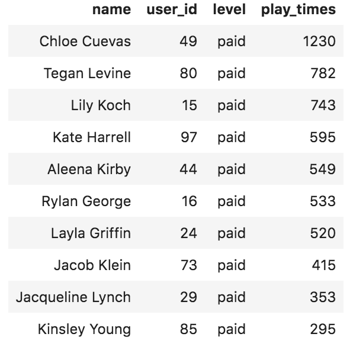

# Sparkify song play analysis databasse project

Create a Postgres database with tables designed to optimize queries on song play analysis for Sparkify. My role is to create a database schema and ETL pipeline for this analysis.

## Dataset 

The first dataset is a subset of real data from the  **[Million Song Dataset](https://labrosa.ee.columbia.edu/millionsong/)**. Each file is in JSON format and contains metadata about a song and the artist of that song. 

The second dataset consists of log files in JSON format generated by this **[event simulator](https://github.com/Interana/eventsim)** based on the songs in the dataset above. 

## Soluctions

Create the star schema design to assist the analysis of song play. Use the song play log to create fact table, and extract use users, artists, songs, time data to design each dimesion table. The ETL pipleline utilizes pandas to load all the log files and song files as dataframe. Process the data while looping through all the files and populate the related tables for future analytics.  

## Scripts

### Create database

**create_tables.py** drops and creates your tables. You run this file to reset your tables before each time you run your ETL scripts.

**sql_queries.py** contains all your sql queries, and is imported into the last three files above.
README.md provides discussion on your project.

### Build ETL pipeline

**etl.ipynb** reads and processes a single file from song_data and log_data and loads the data into the tables. This notebook contains detailed instructions on the ETL process for each of the tables.

**etl.py** reads and processes files from song_data and log_data and loads them into the tables.

### Testing
**test.ipynb** displays the first 5 rows of each table to check the database.


## Running the tests

The data folder includes sample data for testting. Run create_tables.py and follow by the etl.py in terminal to create talbes and load data. Using test.ipynb to check the result.

## Sample Query

### Daily active users
   
```
SELECT t.day, count(distinct(user_id)) AS distinct_users FROM songplays sp 
JOIN time t on sp.start_time = t.start_time 
GROUP BY t.day;
```


### Top 10 sony play users

```
SELECT concat(u.first_name,' ', u.last_name) AS name, sp.user_id, sp.level, count(*) AS play_times FROM songplays sp 
JOIN users u on sp.user_id = u.user_id 
GROUP BY concat(u.first_name,' ', u.last_name), sp.user_id, sp.level 
ORDER BY count(*) DESC LIMIT 10;
```

